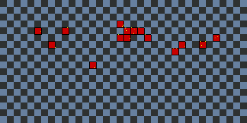
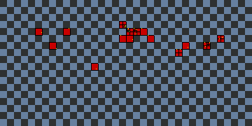

# Patch simulation

Demonstrate simply the Patch algorithm to divide the world inside patch of 10% degree (lat/lon) and position peers inside.
It also provide a simple way to divide a patch into subpatch, if a patch contains already a peer position inside.

|Algorithm|Image|
|---|---|
|Without subpatches||
|With subpatches||